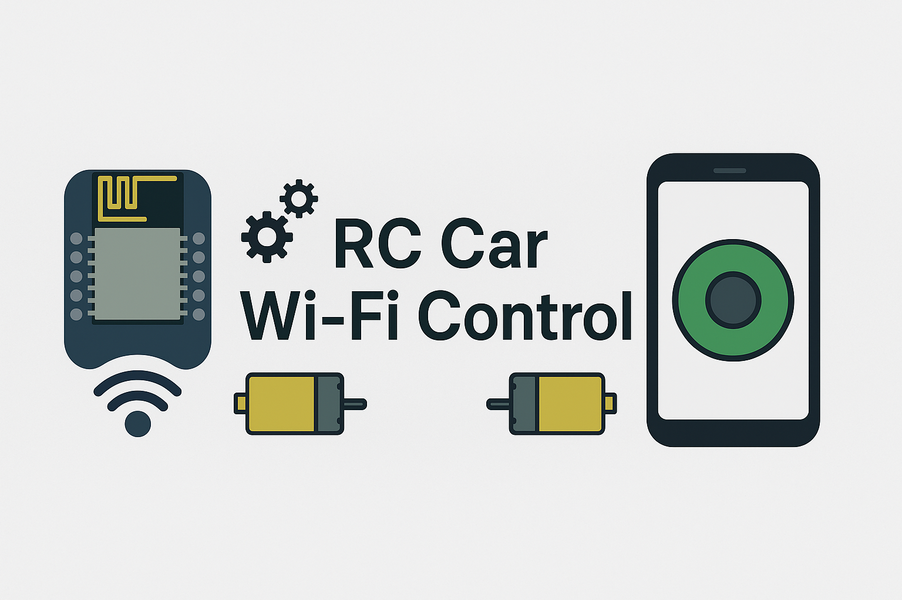

# Wi-Fi Controlled RC Car (ESP8266)

  

An ESP8266-based RC car that creates its own Wi-Fi network and lets you steer it with a built-in web joystick.  
Control your motors and servo directly from any phone or laptop browser — no external internet required.

---

## 🔧 Hardware
- **ESP8266 board:** D1 Mini Pro / NodeMCU 1.0  
- **Motor driver:** L298N dual H-bridge  
- **Steering:** SG90 servo motor  
- **Drive motor(s):** DC gear motor(s)  
- **Power:** Li-ion battery pack (shared ground with ESP8266)

---

## 🧠 Software Setup
- **Arduino IDE** (2.x)
- **Libraries**
  - `ESP8266WiFi.h`
  - `ESP8266WebServer.h`
  - `WebSocketsServer.h`
  - `ArduinoJson.h` (v6)
  - `Servo.h`

**Board manager URL:**  
`http://arduino.esp8266.com/stable/package_esp8266com_index.json`

Install via *Tools → Board → Boards Manager → ESP8266 → Install*.

---

## 🌐 Features
- Creates a **local Wi-Fi Access Point** (no router needed)
- Hosts a **joystick web interface** from `website.h`
- Sends real-time motor/servo commands via **WebSocket**
- Processes joystick X/Y values for:
  - forward / reverse speed control
  - left / right steering angle

---

## 📁 File Overview
| File | Description |
|------|--------------|
| **rc_car.ino** | Main firmware that runs the web server and handles WebSocket events |
| **functions.h** | Pin definitions and helper functions for motor and steering control |
| **website.h** | Embedded HTML + JavaScript joystick UI |
| **assets/demo.mp4** | *(optional)* demonstration video |
| **assets/poster.png** | *(optional)* project banner or thumbnail image |

---

## ⚙️ Pin Connections
| Component | ESP8266 Pin |
|------------|-------------|
| MOTOR_IN1 | D1 |
| MOTOR_IN2 | D2 |
| EN_PIN | D5 |
| SERVO_PIN | D8 |

Ensure all **grounds are common** (ESP8266, L298N, battery).

---

## 🕹️ Usage
1. Flash `rc_car.ino` to your ESP8266.  
2. Connect to Wi-Fi:

SSID: cappuccino_assassino
Password: cappuccina_ballerina

3. Open your browser at **http://192.168.4.1**
4. Use the on-screen joystick to drive and steer!

---

## 🎥 Demo Preview
Here’s a short preview of the RC car in action!

<!-- 🎞️ Embedded demo video -->
<video src="assets/demo.mp4" width="600" controls autoplay loop muted></video>

<em>If the video doesn’t play, <a href="assets/demo.mp4">click here to view it directly</a>.</em>

---

## 🏗️ Future Ideas
- Add a live **camera stream**
- OTA (Over-The-Air) firmware updates
- PID control for smoother steering
- Improved mobile-friendly joystick UI

---

## 🪪 License
MIT License – see [LICENSE](LICENSE) for details.
